# Employee Salary Management System - Application Flow Document

## Table of Contents
1. [Introduction](#introduction)
2. [System Flow Overview](#system-flow-overview)
3. [Feature-wise Business Flows](#feature-wise-business-flows)
4. [Sequence Diagrams](#sequence-diagrams)
5. [Data Flow Diagrams](#data-flow-diagrams)
6. [State Transition Diagrams](#state-transition-diagrams)
7. [Integration Flows](#integration-flows)
8. [Error Handling Flows](#error-handling-flows)
9. [End-to-End Workflows](#end-to-end-workflows)

---

## 1. Introduction

This document provides comprehensive flow diagrams and detailed explanations of all business processes in the Employee Salary Management System. It covers user interactions, system processing, data flows, and integration points.

### Purpose
- Visualize system behavior and business processes
- Document decision points and branching logic
- Illustrate data transformations
- Show integration with external systems
- Provide reference for developers and stakeholders

### Notation
- **Rectangles**: Processes/Actions
- **Diamonds**: Decision points
- **Cylinders**: Data stores
- **Arrows**: Flow direction
- **Dashed lines**: Asynchronous operations

---

## 2. System Flow Overview

### High-Level Application Flow


### User Journey Map


---

## 3. Feature-wise Business Flows

### 3.1 Employee Management Flow

#### Create Employee Flow


**Key Points:**
- Mobile number uniqueness is enforced at database level
- Default values: active=true, auto-timestamps
- Both client and server validation
- Immediate feedback to user

#### Update Employee Flow


**Key Points:**
- Loads current data before editing
- Mobile uniqueness checked only if changed
- Updated timestamp automatically maintained
- Cannot change employee ID

#### Deactivate Employee Flow


**Key Points:**
- Soft delete (no data removal)
- Confirmation required
- Employee data preserved for historical records
- Cannot generate new salaries for inactive employees

---

### 3.2 Advance Management Flow


**Business Rules:**
1. Amount must be positive
2. Date can be past or present (not future)
3. Multiple advances allowed per day
4. Only active employees can receive advances
5. Advances are deducted from salary in the month they are recorded

**View Advances Flow:**


---

### 3.3 Leave Management Flow


**Business Rules:**
1. Two leave types: PAID and UNPAID
2. Only UNPAID leaves affect salary calculation
3. Leave date validation (cannot be future date typically)
4. Multiple leaves can be recorded per day (e.g., half-day scenarios)
5. Leave deduction formula: (Base Salary / Days in Month) × Number of Unpaid Leaves

**Leave Type Decision Matrix:**

| Leave Type | Salary Impact | Calculation |
|------------|---------------|-------------|
| PAID | None | No deduction |
| UNPAID | Deduction | (Base Salary ÷ 30) × Days |

---

### 3.4 Overtime Management Flow


**Business Rules:**
1. Hours and rate must be positive
2. Total amount calculated automatically: Hours × Rate Per Hour
3. Multiple overtime entries allowed per day
4. Overtime is added to salary in the month it is recorded
5. Rate per hour can vary by entry (different rates for different days)

**Overtime Calculation Example:**

```
Date: 2025-01-15
Hours: 3.5
Rate per Hour: Rs 500
Total Amount: 3.5 × 500 = Rs 1,750
```

---

### 3.5 Salary Calculation Flow

#### Salary Preview Flow


**Salary Calculation Formula:**

```
1. Base Salary = Employee's current base salary
2. Total Overtime = Sum of (Hours × Rate) for all overtime in month
3. Total Advances = Sum of all advance amounts in month
4. Unpaid Leave Days = Count of UNPAID leaves in month
5. Leave Deduction = (Base Salary ÷ Days in Month) × Unpaid Leave Days
6. PF Deduction = Base Salary × (PF Percentage ÷ 100)

Final Salary = Base Salary 
             + Total Overtime 
             - Total Advances 
             - PF Deduction 
             - Leave Deduction
```

#### Salary Generation Flow


**Key Points:**
1. Duplicate prevention: One salary per employee per month
2. Denormalized storage: All amounts stored in salary record
3. Detailed audit trail: salary_details stores date-wise breakdown
4. Amounts stored with 2 decimal precision
5. Historical accuracy: Base salary snapshot stored

---

### 3.6 SMS Notification Flow


**SMS Content Format:**

```
Salary Slip - Jan 2025
Emp: John Doe
Base: Rs 50000.00

Date-wise Details:
18/01: OVERTIME +Rs 1750.00 (3.5 hrs @ 500.0/hr)
15/01: ADVANCE -Rs 5000.00 (Emergency advance)
20/01: LEAVE -Rs 1666.67 (Unpaid leave)

Overtime: +Rs 1750.00
Advances: -Rs 5000.00
PF: -Rs 6000.00
Leaves: -Rs 3333.33
Final: Rs 37416.67
```

**Phone Number Formatting Rules:**

```
Input: 9876543210 → Output: +919876543210
Input: +919876543210 → Output: +919876543210
Input: 919876543210 → Output: +919876543210
```

---

### 3.7 Dashboard Flow


**Dashboard Metrics:**

1. **Total Employees**: Count of all employee records
2. **Active Employees**: Count where active = true
3. **Total Salary This Month**: Sum of final_salary for current month
4. **Total Salary Last Month**: Sum of final_salary for previous month
5. **Pending Salary Generations**: Count of active employees without salary record for current month

---

## 4. Sequence Diagrams

### 4.1 Complete Salary Generation Sequence


### 4.2 Employee Creation Sequence


### 4.3 Transaction Recording Sequence (Advance/Leave/Overtime)


---

## 5. Data Flow Diagrams

### 5.1 Level 0 - Context Diagram


### 5.2 Level 1 - Major Processes


### 5.3 Level 2 - Salary Calculation Process Detail


---

## 6. State Transition Diagrams

### 6.1 Employee State Transitions

```mermaid
stateDiagram-v2
    [*] --> Created: Create Employee
    Created --> Active: Auto-activation<br/>(active=true by default)
    Active --> Active: Update Details
    Active --> Inactive: Deactivate Employee
    Inactive --> Active: Reactivate Employee<br/>(Manual DB update)
    Active --> [*]: Hard Delete<br/>(Not Implemented)
    
    note right of Active
        Can have transactions
        Can generate salary
        Visible in active lists
    end note
    
    note right of Inactive
        No new transactions
        No new salary generation
        Historical data preserved
    end note
```



### 6.2 Salary Record State Transitions

```mermaid
stateDiagram-v2
    [*] --> NotGenerated: Month Begins
    NotGenerated --> Preview: Request Preview
    Preview --> NotGenerated: Cancel/Modify Data
    Preview --> Generated: Generate Salary
    Generated --> SMSPending: Save Complete
    SMSPending --> SMSSent: Send SMS Success
    SMSPending --> SMSFailed: Send SMS Failure
    SMSSent --> SMSResent: Resend SMS
    SMSFailed --> SMSRetry: Retry Send
    SMSRetry --> SMSSent: Success
    SMSRetry --> SMSFailed: Failure
    SMSSent --> [*]: End of Workflow
    
    note right of Generated
        sms_sent = false
        sms_sent_at = null
    end note
    
    note right of SMSSent
        sms_sent = true
        sms_sent_at = timestamp
    end note
    
    note left of NotGenerated
        Transactions can be
        added/modified/deleted
    end note
    
    note left of Generated
        Transactions locked
        (modification not recommended)
    end note
```

### 6.3 SMS Delivery State Machine

```mermaid
stateDiagram-v2
    [*] --> Initialized: Trigger Send SMS
    Initialized --> ConfigCheck: Check Twilio Config
    ConfigCheck --> ConfigError: Not Configured
    ConfigCheck --> PhoneFormat: Config Valid
    PhoneFormat --> ContentBuild: Format Phone Number
    ContentBuild --> TwilioCall: Build SMS Content
    TwilioCall --> Sending: Call Twilio API
    Sending --> Success: HTTP 200 + SID
    Sending --> NetworkError: Network Failure
    Sending --> APIError: Twilio API Error
    Success --> UpdateDB: Update sms_sent=true
    UpdateDB --> [*]: Complete
    NetworkError --> UpdateFailed: Update sms_sent=false
    APIError --> UpdateFailed
    ConfigError --> [*]: Abort
    UpdateFailed --> [*]: Complete with Error
    
    note right of Success
        SMS queued by Twilio
        Delivery status tracked
        by Twilio webhook (future)
    end note
```

---

## 7. Integration Flows

### 7.1 Twilio SMS Integration Flow

```mermaid
flowchart TD
    start([SMS Send Request]) --> loadConfig[Load Twilio Configuration<br/>Account SID, Auth Token, Phone]
    loadConfig --> validateConfig{All Credentials<br/>Present?}
    
    validateConfig -->|No| logError[Log Configuration Error]
    logError --> returnError[Return Error Response]
    returnError --> done([End])
    
    validateConfig -->|Yes| initSDK[Initialize Twilio SDK<br/>Twilio.init]
    initSDK --> fetchSalary[Fetch Salary Record<br/>from Database]
    fetchSalary --> fetchDetails[Fetch Salary Details<br/>from Database]
    fetchDetails --> getEmployee[Get Employee Info<br/>Name, Mobile]
    
    getEmployee --> formatPhone[Format Phone Number]
    formatPhone --> validatePhone{Valid Phone<br/>Format?}
    
    validatePhone -->|No| logPhoneError[Log Phone Format Error]
    logPhoneError --> returnError
    
    validatePhone -->|Yes| buildContent[Build SMS Content<br/>Format Salary Slip Text]
    buildContent --> createMessage[Create Twilio Message<br/>Message.creator]
    createMessage --> setParams[Set Parameters<br/>To, From, Body]
    setParams --> sendAPI[Call create Method<br/>Send to Twilio API]
    
    sendAPI --> twilioProcess{Twilio API<br/>Response}
    
    twilioProcess -->|Success| getSID[Get Message SID]
    getSID --> updateSuccess[Update Database<br/>sms_sent = true<br/>sms_sent_at = now]
    updateSuccess --> logSuccess[Log Success with SID]
    logSuccess --> returnSuccess[Return Success Response]
    returnSuccess --> done
    
    twilioProcess -->|Error| parseError[Parse Error Message]
    parseError --> updateFailed[Update Database<br/>sms_sent = false]
    updateFailed --> logFailure[Log Failure with Error]
    logFailure --> returnError
```

**Twilio API Call Details:**

```java
Message message = Message.creator(
    new PhoneNumber("+919876543210"),  // To
    new PhoneNumber(twilioPhoneNumber), // From
    smsContent                           // Body
).create();
```

**Error Scenarios:**
1. **Configuration Error**: Missing credentials → Return 500
2. **Phone Format Error**: Invalid phone number → Return 400
3. **Network Error**: Cannot reach Twilio → Return 500
4. **API Error**: Twilio rejects request → Return 500
5. **Rate Limit**: Twilio rate limit exceeded → Return 429

### 7.2 Database Transaction Flow

```mermaid
flowchart TD
    start([Service Method Called]) --> transStart[@Transactional<br/>Begin Transaction]
    transStart --> bizLogic[Execute Business Logic]
    bizLogic --> query1[Database Query 1]
    query1 --> query2[Database Query 2]
    query2 --> calculation[Perform Calculations]
    calculation --> save1[Database Save 1]
    save1 --> save2[Database Save 2]
    save2 --> checkException{Exception<br/>Occurred?}
    
    checkException -->|Yes| rollback[Rollback Transaction]
    rollback --> logError[Log Error]
    logError --> throwException[Throw Exception]
    throwException --> done([End])
    
    checkException -->|No| commit[Commit Transaction]
    commit --> returnSuccess[Return Success]
    returnSuccess --> done
```

**Transaction Management:**
- `@Transactional` on service methods
- Automatic rollback on RuntimeException
- Commit on successful completion
- Read-only transactions for queries

---

## 8. Error Handling Flows

### 8.1 Global Exception Handling Flow

```mermaid
flowchart TD
    start([Exception Occurs]) --> checkType{Exception<br/>Type?}
    
    checkType -->|ResourceNotFoundException| handle404[GlobalExceptionHandler<br/>handleResourceNotFoundException]
    handle404 --> build404[Build ApiResponse<br/>success = false]
    build404 --> return404[Return 404 Not Found]
    return404 --> logError404[Log Error]
    logError404 --> done([End])
    
    checkType -->|IllegalArgumentException| handle400[GlobalExceptionHandler<br/>handleIllegalArgumentException]
    handle400 --> build400[Build ApiResponse<br/>success = false]
    build400 --> return400[Return 400 Bad Request]
    return400 --> logError400[Log Error]
    logError400 --> done
    
    checkType -->|MethodArgumentNotValidException| handleValidation[GlobalExceptionHandler<br/>handleValidationExceptions]
    handleValidation --> extractErrors[Extract Field Errors<br/>from BindingResult]
    extractErrors --> buildMap[Build Error Map<br/>field: message]
    buildMap --> buildValidation[Build ApiResponse<br/>success = false<br/>data = error map]
    buildValidation --> return400Val[Return 400 Bad Request]
    return400Val --> logErrorVal[Log Validation Errors]
    logErrorVal --> done
    
    checkType -->|Exception Generic| handle500[GlobalExceptionHandler<br/>handleGenericException]
    handle500 --> build500[Build ApiResponse<br/>success = false]
    build500 --> return500[Return 500 Internal Server Error]
    return500 --> logError500[Log Full Stack Trace]
    logError500 --> alertAdmin[Alert Administrator<br/>Critical Error]
    alertAdmin --> done
```

### 8.2 Validation Error Flow

```mermaid
flowchart TD
    start([Request Received]) --> parseRequest[Parse Request Body]
    parseRequest --> validate[@Valid Annotation<br/>Triggers Validation]
    validate --> checkConstraints{All Constraints<br/>Satisfied?}
    
    checkConstraints -->|Yes| proceed[Proceed to Controller Method]
    proceed --> done([Continue Processing])
    
    checkConstraints -->|No| collectErrors[Collect All Validation Errors]
    collectErrors --> buildErrorMap[Build Error Map]
    
    buildErrorMap --> exampleErrors[Example Errors:<br/>name: must not be blank<br/>mobile: must match pattern<br/>baseSalary: must be greater than 0]
    
    exampleErrors --> throwException[Throw MethodArgumentNotValidException]
    throwException --> globalHandler[Global Exception Handler]
    globalHandler --> formatResponse[Format Error Response]
    formatResponse --> returnToClient[Return 400 with Error Map]
    returnToClient --> clientDisplay[Client Displays Field Errors]
    clientDisplay --> done
```

**Validation Annotations Used:**
- `@NotNull`: Field cannot be null
- `@NotBlank`: String cannot be empty
- `@Min`: Minimum numeric value
- `@Max`: Maximum numeric value
- `@Pattern`: Regex pattern match
- `@Valid`: Nested object validation

---

## 9. End-to-End Workflows

### 9.1 Complete Monthly Salary Workflow

```mermaid
flowchart TD
    monthStart([Month Begins]) --> dailyOps[Daily Operations]
    
    dailyOps --> recordAdv{Employee Requests<br/>Advance?}
    recordAdv -->|Yes| createAdv[Record Advance<br/>POST /api/advances]
    recordAdv -->|No| checkLeave
    createAdv --> checkLeave{Employee Takes<br/>Leave?}
    
    checkLeave -->|Yes| recordLeave[Record Leave<br/>POST /api/leaves<br/>Type: PAID/UNPAID]
    checkLeave -->|No| checkOT
    recordLeave --> checkOT{Employee Works<br/>Overtime?}
    
    checkOT -->|Yes| recordOT[Record Overtime<br/>POST /api/overtimes]
    checkOT -->|No| nextDay{More Days<br/>in Month?}
    recordOT --> nextDay
    
    nextDay -->|Yes| dailyOps
    nextDay -->|No| monthEnd[Month End Approaches]
    
    monthEnd --> reviewData[Admin Reviews<br/>Transaction Data]
    reviewData --> corrections{Need<br/>Corrections?}
    corrections -->|Yes| modifyData[Modify/Delete Transactions]
    modifyData --> reviewData
    
    corrections -->|No| previewSalary[Preview Salary<br/>POST /api/salaries/preview]
    previewSalary --> reviewPreview[Review Salary Calculation<br/>& Date-wise Breakdown]
    reviewPreview --> approvePreview{Approve<br/>Calculation?}
    
    approvePreview -->|No| modifyData
    approvePreview -->|Yes| generateSalary[Generate Salary<br/>POST /api/salaries/generate]
    
    generateSalary --> checkGenerated{Generation<br/>Success?}
    checkGenerated -->|No| investigateError[Investigate Error<br/>Fix Issues]
    investigateError --> generateSalary
    
    checkGenerated -->|Yes| sendSMS[Send SMS<br/>POST /api/salaries/:id/send-sms]
    sendSMS --> checkSMS{SMS<br/>Success?}
    
    checkSMS -->|No| retrySMS{Retry<br/>SMS?}
    retrySMS -->|Yes| sendSMS
    retrySMS -->|No| manualNotify[Notify Employee Manually]
    
    checkSMS -->|Yes| employeeReceives[Employee Receives<br/>Salary Slip SMS]
    manualNotify --> updateRecords[Update Salary Records]
    employeeReceives --> updateRecords
    
    updateRecords --> nextEmployee{More<br/>Employees?}
    nextEmployee -->|Yes| previewSalary
    nextEmployee -->|No| generateReports[Generate Monthly Reports<br/>Dashboard Statistics]
    
    generateReports --> archiveData[Archive Monthly Data]
    archiveData --> nextMonth([Next Month Begins])
```

### 9.2 New Employee Onboarding Workflow

```mermaid
flowchart TD
    start([New Employee Joins]) --> gatherInfo[Gather Employee Information<br/>Name, Mobile, Base Salary, PF%]
    gatherInfo --> verifyInfo[Verify Information Accuracy]
    verifyInfo --> checkDuplicate{Mobile Number<br/>Already Exists?}
    
    checkDuplicate -->|Yes| updateExisting[Update Existing Record<br/>or Resolve Conflict]
    updateExisting --> done([End])
    
    checkDuplicate -->|No| createEmployee[Create Employee<br/>POST /api/employees]
    createEmployee --> verifyCreation{Created<br/>Successfully?}
    
    verifyCreation -->|No| fixErrors[Fix Validation Errors]
    fixErrors --> createEmployee
    
    verifyCreation -->|Yes| confirmActive[Confirm Employee Status<br/>active = true]
    confirmActive --> setupTransactions[Setup Transaction Tracking<br/>Ready for Advances/Leaves/OT]
    setupTransactions --> informEmployee[Inform Employee<br/>Mobile # Registered]
    informEmployee --> onboardingComplete[Onboarding Complete<br/>Employee in System]
    onboardingComplete --> waitForMonth[Wait for Month End]
    waitForMonth --> firstSalary[Generate First Salary<br/>Pro-rated if Mid-Month]
    firstSalary --> done
```

### 9.3 Employee Exit Workflow

```mermaid
flowchart TD
    start([Employee Decides to Leave]) --> noticeAdmin[Notify Administrator]
    noticeAdmin --> calcFinal[Calculate Final Settlement<br/>Pro-rated Salary + Dues]
    calcFinal --> reviewTransactions[Review All Pending Transactions<br/>Advances, Leaves, Overtime]
    reviewTransactions --> finalSalary[Generate Final Salary<br/>Include Exit Month]
    finalSalary --> sendFinalSMS[Send Final Salary SMS]
    sendFinalSMS --> settlePayment[Settle Payment with Employee]
    settlePayment --> deactivateEmployee[Deactivate Employee<br/>DELETE /api/employees/:id<br/>Sets active = false]
    deactivateEmployee --> verifyDeactivation{Deactivation<br/>Success?}
    
    verifyDeactivation -->|No| investigateIssue[Investigate Issue]
    investigateIssue --> deactivateEmployee
    
    verifyDeactivation -->|Yes| archiveData[Archive Employee Data<br/>Historical Records Preserved]
    archiveData --> updateDashboard[Update Dashboard<br/>Reduce Active Count]
    updateDashboard --> notifyTeam[Notify Relevant Teams]
    notifyTeam --> exitComplete([Exit Process Complete])
```

### 9.4 Error Resolution Workflow

```mermaid
flowchart TD
    start([Error Detected]) --> identifyError[Identify Error Type<br/>& Source]
    identifyError --> checkType{Error<br/>Category?}
    
    checkType -->|Data Entry Error| reviewTransaction[Review Transaction Details]
    reviewTransaction --> deleteWrong[Delete Incorrect Record<br/>DELETE /api/{resource}/:id]
    deleteWrong --> enterCorrect[Enter Correct Data<br/>POST /api/{resource}]
    enterCorrect --> verify[Verify Correction]
    verify --> done([Error Resolved])
    
    checkType -->|Calculation Error| checkGenerated{Salary Already<br/>Generated?}
    checkGenerated -->|No| fixTransactions[Fix Transaction Data]
    fixTransactions --> recalculate[Recalculate Preview]
    recalculate --> verify
    
    checkGenerated -->|Yes| documentAdjustment[Document Adjustment]
    documentAdjustment --> nextMonthCorrection[Apply Correction in<br/>Next Month Salary]
    nextMonthCorrection --> notifyEmployee[Notify Employee<br/>of Correction]
    notifyEmployee --> done
    
    checkType -->|SMS Delivery Error| checkConfig{Twilio<br/>Configured?}
    checkConfig -->|No| configureTwilio[Configure Twilio Credentials]
    configureTwilio --> retrySMS[Retry SMS Send]
    retrySMS --> checkSuccess{Success?}
    checkSuccess -->|Yes| done
    checkSuccess -->|No| manualNotify[Send Manual Notification]
    manualNotify --> done
    
    checkConfig -->|Yes| checkPhoneFormat{Phone Number<br/>Valid?}
    checkPhoneFormat -->|No| updatePhone[Update Employee<br/>Phone Number]
    updatePhone --> retrySMS
    checkPhoneFormat -->|Yes| checkTwilioStatus[Check Twilio<br/>Service Status]
    checkTwilioStatus --> contactSupport[Contact Twilio Support]
    contactSupport --> manualNotify
    
    checkType -->|System Error| checkLogs[Review System Logs]
    checkLogs --> identifyBug[Identify Bug/Issue]
    identifyBug --> reportBug[Report to Development Team]
    reportBug --> implementFix[Implement Fix]
    implementFix --> testFix[Test Fix]
    testFix --> deployFix[Deploy Fix]
    deployFix --> done
```

---

## Appendix: Flow Glossary

### Key Terms

- **Active Employee**: Employee with `active = true`, eligible for transactions and salary generation
- **Inactive Employee**: Employee with `active = false`, preserved for historical records
- **Soft Delete**: Setting `active = false` instead of removing record
- **Hard Delete**: Permanent removal from database (not implemented)
- **Transaction**: General term for Advance, Leave, or Overtime record
- **Date-wise Breakdown**: Detailed listing of all transactions by date
- **Salary Preview**: Calculation without saving to database
- **Salary Generation**: Calculation with database persistence
- **SMS Delivery Status**: Tracked via `sms_sent` and `sms_sent_at` fields
- **Denormalization**: Storing calculated values (e.g., salary components) for historical accuracy
- **Idempotency**: Preventing duplicate salary generation for same employee-month-year

### Business Calculations

#### Daily Salary
```
Daily Salary = Base Salary ÷ Number of Days in Month
```

#### Overtime Amount
```
Overtime Amount = Hours × Rate Per Hour
```

#### Leave Deduction
```
Leave Deduction = Daily Salary × Number of Unpaid Leave Days
```

#### PF Deduction
```
PF Deduction = Base Salary × (PF Percentage ÷ 100)
```

#### Final Salary
```
Final Salary = Base Salary
             + Total Overtime
             - Total Advances
             - PF Deduction
             - Leave Deduction
```

### HTTP Status Codes Used

| Code | Meaning | Usage |
|------|---------|-------|
| 200 | OK | Successful GET, POST, PUT operations |
| 400 | Bad Request | Validation errors, business logic errors |
| 404 | Not Found | Resource doesn't exist |
| 500 | Internal Server Error | Unexpected server errors, integration failures |

### Common Flow Patterns

1. **CRUD Pattern**: Create → Read → Update → Delete
2. **Preview-Generate Pattern**: Preview → Review → Generate → Confirm
3. **Request-Validate-Process-Respond**: Standard API flow
4. **Fetch-Calculate-Save**: Salary calculation pattern
5. **Trigger-Check-Execute-Update**: SMS sending pattern

---

## Document Metadata

- **Document Type**: Application Flow Document
- **Version**: 1.0
- **Date**: January 1, 2025
- **Purpose**: Technical reference for developers and stakeholders
- **Related Documents**: System Design Document, API Documentation, POSTMAN Collection
- **Maintained By**: Development Team
- **Last Updated**: January 1, 2025

---

## Change Log

| Version | Date | Changes | Author |
|---------|------|---------|--------|
| 1.0 | 2025-01-01 | Initial document creation | System Team |

---

## Notes

This flow document should be updated whenever:
- New features are added
- Business logic changes
- API endpoints are modified
- Integration points are updated
- Error handling is improved

All diagrams use Mermaid syntax for easy maintenance and version control.

