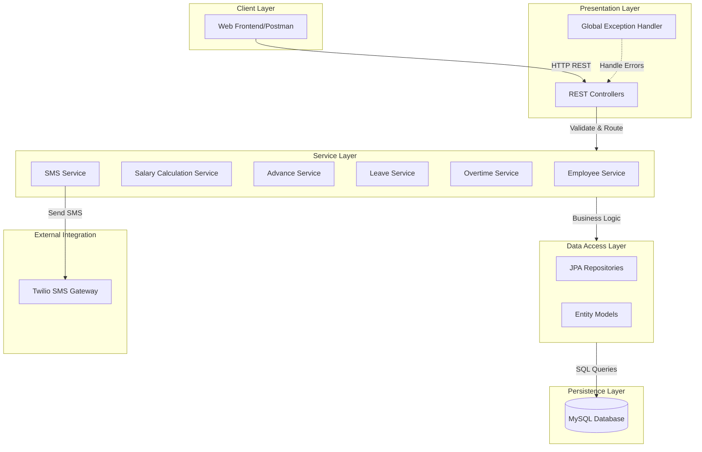
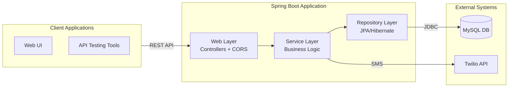
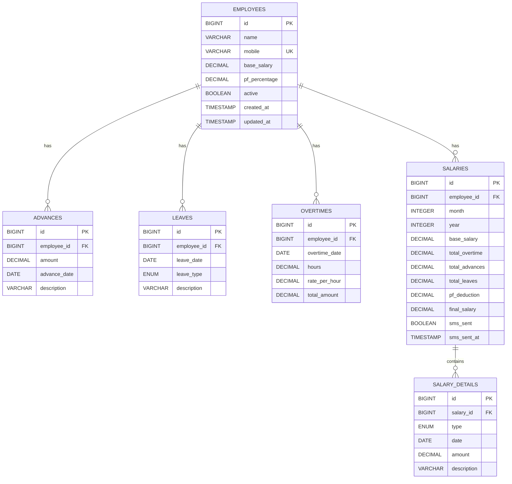
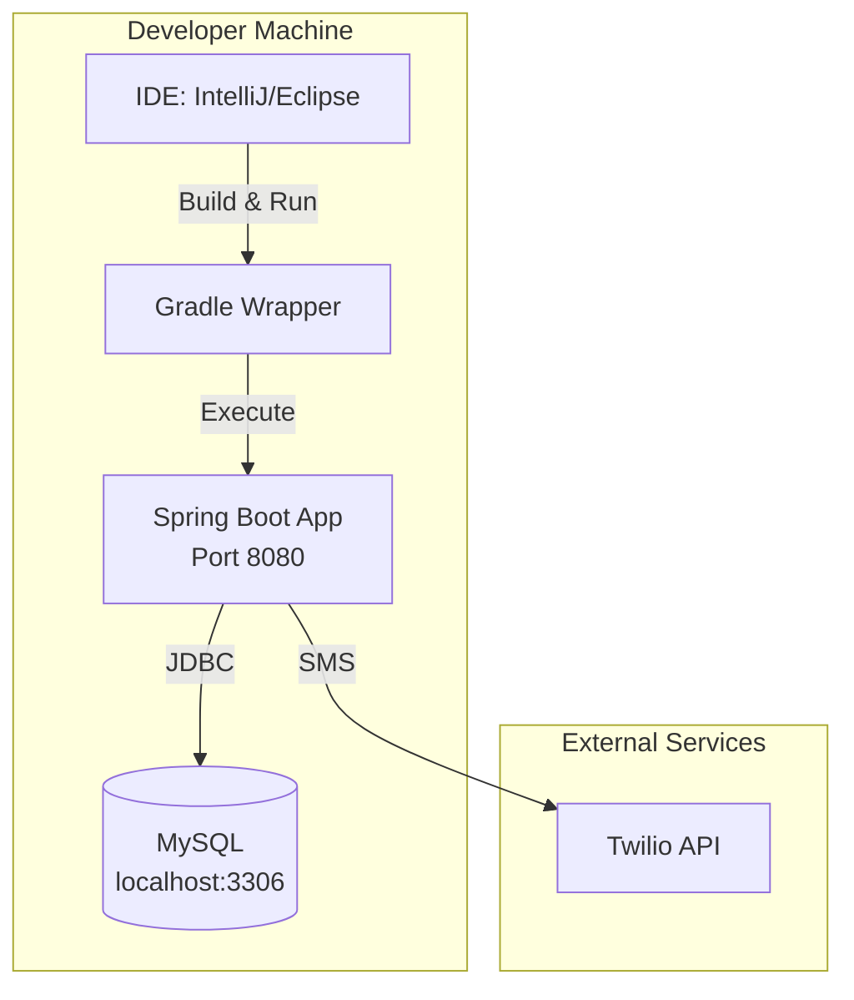
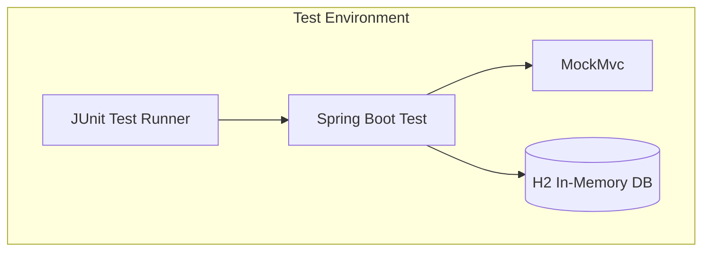
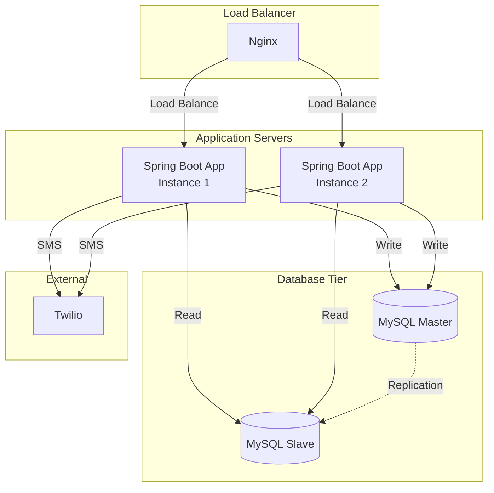
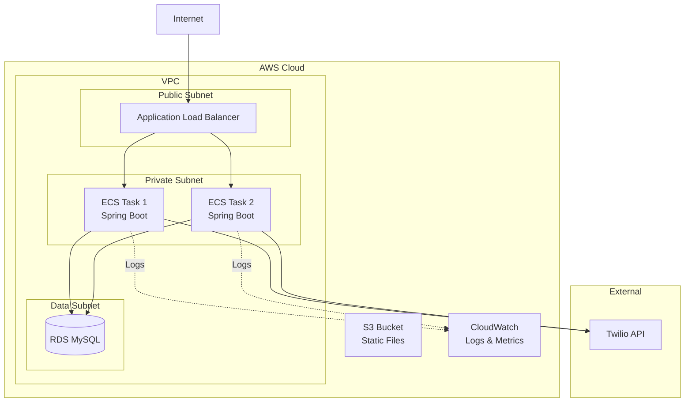

# Employee Salary Management System - System Design Document

## Table of Contents
1. [Executive Summary](#executive-summary)
2. [System Overview](#system-overview)
3. [Architecture Design](#architecture-design)
4. [Database Design](#database-design)
5. [API Specifications](#api-specifications)
6. [Component Architecture](#component-architecture)
7. [Business Logic & Rules](#business-logic--rules)
8. [Security Considerations](#security-considerations)
9. [Configuration Management](#configuration-management)
10. [Deployment Architecture](#deployment-architecture)

---

## 1. Executive Summary

The Employee Salary Management System is a comprehensive backend application built using Spring Boot that manages employee information, tracks salary advances, leaves, overtime, calculates monthly salaries, and sends automated SMS notifications. The system follows a layered architecture pattern with clear separation of concerns between data access, business logic, and presentation layers.

### Key Features
- **Employee Management**: CRUD operations for employee records with activation/deactivation
- **Advance Salary Tracking**: Date-wise tracking of salary advances
- **Leave Management**: Separate tracking for paid and unpaid leaves
- **Overtime Management**: Record overtime hours with configurable rates
- **Automated Salary Calculation**: Complex salary computation with multiple factors
- **SMS Notifications**: Automated salary slip delivery via Twilio
- **Dashboard Analytics**: Real-time statistics and insights

### Technology Stack
- **Framework**: Spring Boot 3.2.0
- **Language**: Java 17
- **Build Tool**: Gradle 8.x
- **Database**: MySQL 8.0+ (Production), H2 (Testing)
- **ORM**: Spring Data JPA / Hibernate
- **SMS Gateway**: Twilio SDK 9.14.0
- **Validation**: Jakarta Validation API
- **Utilities**: Lombok (code generation)

---

## 2. System Overview

### Architecture Pattern
The system follows a **Layered Architecture** pattern with the following layers:



### Component Overview

#### 1. Presentation Layer (Controllers)
- `AuthController`: Authentication endpoints
- `EmployeeController`: Employee CRUD operations
- `AdvanceController`: Advance salary management
- `LeaveController`: Leave management
- `OvertimeController`: Overtime tracking
- `SalaryController`: Salary calculation and history
- `DashboardController`: Dashboard statistics

#### 2. Service Layer
- Business logic implementation
- Transaction management
- Data validation
- Complex calculations

#### 3. Data Access Layer (Repositories)
- Spring Data JPA repositories
- Custom query methods
- Database abstraction

#### 4. Entity Layer
- JPA entity models
- Relationship mappings
- Database constraints

---

## 3. Architecture Design

### High-Level System Architecture



### Technology Stack Details

#### Backend Framework
- **Spring Boot 3.2.0**: Core application framework
- **Spring Web**: RESTful web services
- **Spring Data JPA**: Data persistence
- **Spring Validation**: Request validation

#### Database
- **MySQL 8.0+**: Production database with ACID compliance
- **H2 Database**: In-memory database for integration testing
- **Hibernate**: ORM implementation
- **HikariCP**: Connection pooling (default with Spring Boot)

#### Build & Dependency Management
- **Gradle 8.x**: Build automation
- **Spring Dependency Management Plugin**: Version management

#### Development Tools
- **Lombok**: Reduces boilerplate code (@Data, @NoArgsConstructor, etc.)
- **Jakarta Validation**: Bean validation annotations

#### Testing
- **JUnit 5**: Testing framework
- **Spring Boot Test**: Integration testing support
- **MockMvc**: REST controller testing
- **H2**: In-memory testing database

---

## 4. Database Design

### Entity Relationship Diagram



### Table Specifications

#### 1. employees
Primary entity storing employee master data.

| Column | Type | Constraints | Description |
|--------|------|-------------|-------------|
| id | BIGINT | PK, AUTO_INCREMENT | Unique identifier |
| name | VARCHAR(255) | NOT NULL | Employee name |
| mobile | VARCHAR(255) | NOT NULL, UNIQUE | Contact number (unique) |
| base_salary | DECIMAL(10,2) | NOT NULL | Monthly base salary |
| pf_percentage | DECIMAL(5,2) | NOT NULL | PF deduction percentage |
| active | BOOLEAN | NOT NULL, DEFAULT TRUE | Active status |
| created_at | TIMESTAMP | NOT NULL | Record creation time |
| updated_at | TIMESTAMP | NOT NULL | Last update time |

**Indexes:**
- PRIMARY KEY (id)
- UNIQUE INDEX (mobile)
- INDEX (active) - for filtering active employees

**Business Rules:**
- Mobile number must be unique across all employees
- Base salary and PF percentage must be positive
- Soft delete using active flag

---

#### 2. advances
Tracks salary advances given to employees.

| Column | Type | Constraints | Description |
|--------|------|-------------|-------------|
| id | BIGINT | PK, AUTO_INCREMENT | Unique identifier |
| employee_id | BIGINT | NOT NULL, FK | References employees(id) |
| amount | DECIMAL(10,2) | NOT NULL | Advance amount |
| advance_date | DATE | NOT NULL | Date of advance |
| description | VARCHAR(500) | NULL | Optional description |

**Indexes:**
- PRIMARY KEY (id)
- FOREIGN KEY (employee_id) REFERENCES employees(id)
- INDEX (employee_id, advance_date) - for date-range queries

**Business Rules:**
- Amount must be positive
- One or more advances can be recorded per day

---

#### 3. leaves
Tracks employee leave records.

| Column | Type | Constraints | Description |
|--------|------|-------------|-------------|
| id | BIGINT | PK, AUTO_INCREMENT | Unique identifier |
| employee_id | BIGINT | NOT NULL, FK | References employees(id) |
| leave_date | DATE | NOT NULL | Date of leave |
| leave_type | ENUM | NOT NULL | PAID or UNPAID |
| description | VARCHAR(500) | NULL | Optional description |

**Indexes:**
- PRIMARY KEY (id)
- FOREIGN KEY (employee_id) REFERENCES employees(id)
- INDEX (employee_id, leave_date) - for date-range queries
- INDEX (leave_type) - for filtering by type

**Business Rules:**
- Leave type must be either PAID or UNPAID
- Only UNPAID leaves affect salary calculation
- Multiple leaves can be recorded per employee per day (half-day scenarios)

---

#### 4. overtimes
Tracks overtime hours worked by employees.

| Column | Type | Constraints | Description |
|--------|------|-------------|-------------|
| id | BIGINT | PK, AUTO_INCREMENT | Unique identifier |
| employee_id | BIGINT | NOT NULL, FK | References employees(id) |
| overtime_date | DATE | NOT NULL | Date of overtime |
| hours | DECIMAL(5,2) | NOT NULL | Overtime hours |
| rate_per_hour | DECIMAL(10,2) | NOT NULL | Rate per hour |
| total_amount | DECIMAL(10,2) | NOT NULL | Calculated amount |

**Indexes:**
- PRIMARY KEY (id)
- FOREIGN KEY (employee_id) REFERENCES employees(id)
- INDEX (employee_id, overtime_date) - for date-range queries

**Business Rules:**
- Hours must be positive
- total_amount = hours × rate_per_hour (calculated and stored)
- Multiple overtime entries can exist per day

---

#### 5. salaries
Master table for monthly salary records.

| Column | Type | Constraints | Description |
|--------|------|-------------|-------------|
| id | BIGINT | PK, AUTO_INCREMENT | Unique identifier |
| employee_id | BIGINT | NOT NULL, FK | References employees(id) |
| month | INTEGER | NOT NULL | Month (1-12) |
| year | INTEGER | NOT NULL | Year |
| base_salary | DECIMAL(10,2) | NOT NULL | Base salary snapshot |
| total_overtime | DECIMAL(10,2) | NOT NULL | Sum of overtime |
| total_advances | DECIMAL(10,2) | NOT NULL | Sum of advances |
| total_leaves | DECIMAL(10,2) | NOT NULL | Leave deduction amount |
| pf_deduction | DECIMAL(10,2) | NOT NULL | PF deduction amount |
| final_salary | DECIMAL(10,2) | NOT NULL | Final calculated salary |
| sms_sent | BOOLEAN | NOT NULL, DEFAULT FALSE | SMS delivery status |
| sms_sent_at | TIMESTAMP | NULL | SMS sent timestamp |

**Indexes:**
- PRIMARY KEY (id)
- FOREIGN KEY (employee_id) REFERENCES employees(id)
- UNIQUE INDEX (employee_id, month, year) - prevents duplicate salary generation
- INDEX (month, year) - for monthly aggregations

**Business Rules:**
- One salary record per employee per month
- All amounts are denormalized for historical accuracy
- SMS status tracks notification delivery

---

#### 6. salary_details
Date-wise breakdown of salary components.

| Column | Type | Constraints | Description |
|--------|------|-------------|-------------|
| id | BIGINT | PK, AUTO_INCREMENT | Unique identifier |
| salary_id | BIGINT | NOT NULL, FK | References salaries(id) |
| type | ENUM | NOT NULL | OVERTIME, ADVANCE, LEAVE |
| date | DATE | NOT NULL | Transaction date |
| amount | DECIMAL(10,2) | NOT NULL | Amount (positive/negative) |
| description | VARCHAR(500) | NULL | Optional description |

**Indexes:**
- PRIMARY KEY (id)
- FOREIGN KEY (salary_id) REFERENCES salaries(id)
- INDEX (salary_id, date) - for date-ordered retrieval

**Business Rules:**
- Positive amounts: additions (overtime)
- Negative amounts: deductions (advances, leaves)
- Provides detailed audit trail for salary calculation

---

### Database Relationships

1. **Employee → Advances**: One-to-Many (An employee can have multiple advances)
2. **Employee → Leaves**: One-to-Many (An employee can have multiple leaves)
3. **Employee → Overtimes**: One-to-Many (An employee can have multiple overtime entries)
4. **Employee → Salaries**: One-to-Many (An employee has salary records for each month)
5. **Salary → SalaryDetails**: One-to-Many (A salary has multiple line items)

### Data Integrity Constraints

- **Foreign Key Constraints**: Enabled to ensure referential integrity
- **Unique Constraints**: Mobile number, (employee_id + month + year) for salaries
- **Check Constraints**: Positive amounts for salary, advances, overtime
- **Cascade Behavior**: Currently no cascade deletes (soft delete preferred)

---

## 5. API Specifications

### Base URL
```
http://localhost:8080/api
```

### Common Response Format

All API responses follow a standard format:

```json
{
  "success": true/false,
  "message": "Success/Error message",
  "data": { ... }
}
```

### API Endpoints Overview

#### 5.1 Authentication APIs

##### POST /api/auth/login
Authenticate admin user.

**Request:**
```json
{
  "username": "admin",
  "password": "admin123"
}
```

**Response (200 OK):**
```json
{
  "success": true,
  "message": "Login successful",
  "data": {
    "token": "dummy-token",
    "username": "admin"
  }
}
```

**Response (401 Unauthorized):**
```json
{
  "success": false,
  "message": "Invalid username or password",
  "data": null
}
```

---

#### 5.2 Employee Management APIs

##### POST /api/employees
Create a new employee.

**Request:**
```json
{
  "name": "John Doe",
  "mobile": "9876543210",
  "baseSalary": 50000.00,
  "pfPercentage": 12.00
}
```

**Validations:**
- name: Required, not blank
- mobile: Required, 10 digits, unique
- baseSalary: Required, minimum 0
- pfPercentage: Required, 0-100 range

**Response (200 OK):**
```json
{
  "success": true,
  "message": "Success",
  "data": {
    "id": 1,
    "name": "John Doe",
    "mobile": "9876543210",
    "baseSalary": 50000.00,
    "pfPercentage": 12.00,
    "active": true
  }
}
```

##### GET /api/employees
Get all employees.

**Response:**
```json
{
  "success": true,
  "message": "Success",
  "data": [
    {
      "id": 1,
      "name": "John Doe",
      "mobile": "9876543210",
      "baseSalary": 50000.00,
      "pfPercentage": 12.00,
      "active": true
    }
  ]
}
```

##### GET /api/employees/{id}
Get employee by ID.

##### PUT /api/employees/{id}
Update employee details.

##### DELETE /api/employees/{id}
Deactivate employee (soft delete).

---

#### 5.3 Advance Management APIs

##### POST /api/advances
Record a salary advance.

**Request:**
```json
{
  "employeeId": 1,
  "amount": 5000.00,
  "advanceDate": "2025-01-15",
  "description": "Emergency advance"
}
```

##### GET /api/advances/employee/{employeeId}
Get all advances for an employee.

##### GET /api/advances/{id}
Get advance by ID.

##### DELETE /api/advances/{id}
Delete an advance record.

---

#### 5.4 Leave Management APIs

##### POST /api/leaves
Record a leave.

**Request:**
```json
{
  "employeeId": 1,
  "leaveDate": "2025-01-20",
  "leaveType": "UNPAID",
  "description": "Personal work"
}
```

**Leave Types:** PAID, UNPAID

##### GET /api/leaves/employee/{employeeId}
Get all leaves for an employee.

##### DELETE /api/leaves/{id}
Delete a leave record.

---

#### 5.5 Overtime Management APIs

##### POST /api/overtimes
Record overtime hours.

**Request:**
```json
{
  "employeeId": 1,
  "overtimeDate": "2025-01-18",
  "hours": 3.5,
  "ratePerHour": 500.00
}
```

**Note:** `totalAmount` is automatically calculated as `hours × ratePerHour`

##### GET /api/overtimes/employee/{employeeId}
Get all overtime records for an employee.

##### DELETE /api/overtimes/{id}
Delete an overtime record.

---

#### 5.6 Salary Management APIs

##### POST /api/salaries/preview
Preview salary calculation before generation.

**Request:**
```json
{
  "employeeId": 1,
  "month": 1,
  "year": 2025
}
```

**Response:**
```json
{
  "success": true,
  "message": "Success",
  "data": {
    "employeeId": 1,
    "employeeName": "John Doe",
    "employeeMobile": "9876543210",
    "month": 1,
    "year": 2025,
    "baseSalary": 50000.00,
    "totalOvertime": 1750.00,
    "totalAdvances": 5000.00,
    "unpaidLeaveDays": 2,
    "leaveDeduction": 3333.33,
    "pfDeduction": 6000.00,
    "finalSalary": 37416.67,
    "dateWiseBreakdown": [
      {
        "type": "OVERTIME",
        "date": "2025-01-18",
        "amount": 1750.00,
        "description": "Overtime for 3.5 hours"
      },
      {
        "type": "ADVANCE",
        "date": "2025-01-15",
        "amount": -5000.00,
        "description": "Advance taken"
      },
      {
        "type": "LEAVE",
        "date": "2025-01-20",
        "amount": -1666.67,
        "description": "Unpaid leave"
      }
    ]
  }
}
```

##### POST /api/salaries/generate
Generate and save monthly salary.

**Request:** Same as preview

**Response:** Generated salary record

##### GET /api/salaries/employee/{employeeId}
Get salary history for an employee.

##### POST /api/salaries/{salaryId}/send-sms
Send salary slip via SMS.

**Response:**
```json
{
  "success": true,
  "message": "SMS sent successfully",
  "data": null
}
```

---

#### 5.7 Dashboard APIs

##### GET /api/dashboard
Get dashboard statistics.

**Response:**
```json
{
  "success": true,
  "message": "Success",
  "data": {
    "totalEmployees": 10,
    "activeEmployees": 8,
    "totalSalaryThisMonth": 400000.00,
    "totalSalaryLastMonth": 380000.00,
    "pendingSalaryGenerations": 3
  }
}
```

---

### Error Responses

#### Validation Error (400 Bad Request)
```json
{
  "success": false,
  "message": "Validation failed",
  "data": {
    "name": "Name is required",
    "mobile": "Mobile must be 10 digits"
  }
}
```

#### Resource Not Found (404 Not Found)
```json
{
  "success": false,
  "message": "Employee not found with id: 999",
  "data": null
}
```

#### Business Logic Error (400 Bad Request)
```json
{
  "success": false,
  "message": "Salary already generated for employee 1 for month 1/2025",
  "data": null
}
```

#### Server Error (500 Internal Server Error)
```json
{
  "success": false,
  "message": "An error occurred: ...",
  "data": null
}
```

---

## 6. Component Architecture

### 6.1 Entity Models (Domain Layer)

All entities use Lombok annotations for boilerplate reduction and JPA annotations for persistence mapping.

**Common Patterns:**
- `@Entity` - Marks class as JPA entity
- `@Table` - Specifies table name and constraints
- `@Data` - Lombok: generates getters, setters, toString, equals, hashCode
- `@NoArgsConstructor` / `@AllArgsConstructor` - Lombok: constructors
- `@Id` / `@GeneratedValue` - Primary key configuration
- `@ManyToOne` / `@JoinColumn` - Relationship mapping
- `@CreationTimestamp` / `@UpdateTimestamp` - Automatic timestamp management

### 6.2 Repository Layer (Data Access)

All repositories extend `JpaRepository<T, ID>` providing:
- Basic CRUD operations
- Pagination and sorting
- Query derivation from method names
- Custom JPQL queries

**Custom Query Patterns:**

Date-range queries using BETWEEN for database compatibility:
```java
@Query("SELECT a FROM Advance a WHERE a.employee.id = :employeeId " +
       "AND a.advanceDate BETWEEN :startDate AND :endDate")
List<Advance> findByEmployeeIdAndDateRange(
    @Param("employeeId") Long employeeId,
    @Param("startDate") LocalDate startDate,
    @Param("endDate") LocalDate endDate
);
```

### 6.3 Service Layer (Business Logic)

#### EmployeeService
- CRUD operations for employees
- Activation/deactivation logic
- Business validation

#### SalaryCalculationService
Core salary calculation engine:

**Salary Formula:**
```
Final Salary = Base Salary 
               + Total Overtime 
               - Total Advances 
               - PF Deduction 
               - Leave Deduction

Where:
- PF Deduction = Base Salary × (PF Percentage / 100)
- Leave Deduction = (Base Salary / Days in Month) × Unpaid Leave Days
- Total Overtime = Sum of (Hours × Rate Per Hour)
- Total Advances = Sum of advance amounts
```

**Key Methods:**
1. `previewSalary()` - Calculate without saving
2. `generateSalary()` - Calculate and save to database
3. `getSalaryHistory()` - Retrieve historical records

#### SmsService
SMS delivery using Twilio:
- Phone number formatting (adds +91 for Indian numbers)
- SMS content formatting
- Delivery status tracking
- Error handling

**SMS Format:**
```
Salary Slip - Jan 2025
Emp: John Doe
Base: Rs 50000.00

Date-wise Details:
18/01: OVERTIME +Rs 1750.00 (3.5 hrs @ 500.0/hr)
15/01: ADVANCE -Rs 5000.00 (Advance taken)
20/01: LEAVE -Rs 1666.67 (Unpaid leave)

Overtime: +Rs 1750.00
Advances: -Rs 5000.00
PF: -Rs 6000.00
Leaves: -Rs 3333.33
Final: Rs 37416.67
```

### 6.4 Controller Layer (API)

Controllers handle HTTP requests/responses:
- Request validation using `@Valid`
- Response wrapping in `ApiResponse`
- CORS configuration with `@CrossOrigin`
- Transaction management delegation to service layer

**Common Patterns:**
```java
@RestController
@RequestMapping("/api/resource")
@RequiredArgsConstructor
@CrossOrigin(origins = "*")
public class ResourceController {
    
    private final ResourceService service;
    
    @PostMapping
    public ResponseEntity<ApiResponse<ResourceResponse>> create(
            @Valid @RequestBody ResourceRequest request) {
        ResourceResponse result = service.create(request);
        return ResponseEntity.ok(ApiResponse.success(result));
    }
}
```

### 6.5 Exception Handling

`GlobalExceptionHandler` provides centralized error handling:

1. `ResourceNotFoundException` → 404 Not Found
2. `IllegalArgumentException` → 400 Bad Request
3. `MethodArgumentNotValidException` → 400 Bad Request (with field errors)
4. `Exception` → 500 Internal Server Error

### 6.6 Configuration Components

#### TwilioConfig
```java
@Configuration
@Data
public class TwilioConfig {
    @Value("${twilio.account.sid}")
    private String accountSid;
    
    @Value("${twilio.auth.token}")
    private String authToken;
    
    @Value("${twilio.phone.number}")
    private String phoneNumber;
}
```

#### CorsConfig
Allows cross-origin requests from frontend:
```java
@Configuration
public class CorsConfig {
    @Bean
    public WebMvcConfigurer corsConfigurer() {
        return new WebMvcConfigurer() {
            @Override
            public void addCorsMappings(CorsRegistry registry) {
                registry.addMapping("/api/**")
                        .allowedOrigins("*")
                        .allowedMethods("GET", "POST", "PUT", "DELETE");
            }
        };
    }
}
```

---

## 7. Business Logic & Rules

### 7.1 Salary Calculation Rules

#### Base Salary
- Fetched from employee master record
- Stored as snapshot in salary record (historical accuracy)

#### Overtime Calculation
```
Overtime Amount = Hours × Rate Per Hour
Total Overtime = Sum of all overtime entries for the month
```

#### Advance Deduction
```
Total Advances = Sum of all advance amounts for the month
```

#### Leave Deduction
```
Daily Salary = Base Salary ÷ Days in Month
Leave Deduction = Daily Salary × Number of Unpaid Leaves
```
- Only UNPAID leaves affect salary
- PAID leaves have no financial impact

#### PF Deduction
```
PF Deduction = Base Salary × (PF Percentage ÷ 100)
```

#### Final Salary
```
Final Salary = Base Salary 
             + Total Overtime 
             - Total Advances 
             - PF Deduction 
             - Leave Deduction
```

### 7.2 Data Validation Rules

#### Employee
- Name: Required, non-empty
- Mobile: Required, exactly 10 digits, unique
- Base Salary: Required, must be ≥ 0
- PF Percentage: Required, must be 0-100

#### Advance
- Employee ID: Required, must exist
- Amount: Required, must be > 0
- Advance Date: Required, valid date

#### Leave
- Employee ID: Required, must exist
- Leave Date: Required, valid date
- Leave Type: Required, must be PAID or UNPAID

#### Overtime
- Employee ID: Required, must exist
- Overtime Date: Required, valid date
- Hours: Required, must be > 0
- Rate Per Hour: Required, must be > 0

#### Salary Generation
- Employee ID: Required, must exist
- Month: Required, 1-12
- Year: Required, valid year
- Cannot generate salary twice for same employee-month-year combination

### 7.3 Business Constraints

1. **Unique Salary Generation**: One salary per employee per month
2. **Mobile Uniqueness**: Each mobile number belongs to one employee
3. **Soft Delete**: Employees are deactivated, not deleted
4. **Historical Data**: Salary snapshots preserve data at time of generation
5. **Date-wise Tracking**: All transactions (advance, leave, overtime) are date-specific
6. **Automatic Calculations**: Overtime total and final salary are computed automatically

---

## 8. Security Considerations

### Current Implementation

#### Authentication
- **Simple username/password** authentication
- Hardcoded credentials (admin/admin123)
- Returns dummy token
- **Note**: Not production-ready, needs JWT implementation

#### Authorization
- No role-based access control
- All authenticated users have full access

#### CORS
- Currently allows all origins (`origins = "*"`)
- All HTTP methods enabled

#### Data Validation
- Input validation using Jakarta Validation
- SQL injection protection via JPA/Hibernate
- Type-safe queries using JPQL

### Production Security Recommendations

1. **Implement Spring Security**
   - JWT token-based authentication
   - Role-based authorization (ADMIN, MANAGER, VIEWER)
   - Password encryption using BCrypt
   - Session management

2. **CORS Configuration**
   - Restrict to specific frontend domain
   - Limit allowed methods
   - Add credentials support if needed

3. **API Security**
   - Rate limiting
   - Request throttling
   - API key validation for external integrations

4. **Data Security**
   - Encrypt sensitive data at rest
   - Use HTTPS for data in transit
   - Implement audit logging
   - Regular security patches

5. **Database Security**
   - Use database user with minimal privileges
   - Store credentials in environment variables
   - Enable SSL for database connections
   - Regular backups with encryption

6. **SMS Gateway Security**
   - Store Twilio credentials securely (environment variables)
   - Validate phone numbers before sending
   - Implement SMS rate limiting
   - Monitor SMS usage and costs

---

## 9. Configuration Management

### Application Properties

#### Server Configuration
```properties
server.port=8080
```

#### Database Configuration
```properties
spring.datasource.url=jdbc:mysql://localhost:3306/emp_manage_db?createDatabaseIfNotExist=true&useSSL=false&serverTimezone=UTC
spring.datasource.username=root
spring.datasource.password=
spring.datasource.driver-class-name=com.mysql.cj.jdbc.Driver
```

#### JPA Configuration
```properties
spring.jpa.hibernate.ddl-auto=update
spring.jpa.show-sql=true
spring.jpa.properties.hibernate.dialect=org.hibernate.dialect.MySQLDialect
spring.jpa.properties.hibernate.format_sql=true
```

**DDL Auto Modes:**
- `update`: Updates schema (development)
- `validate`: Validates schema (production)
- `create-drop`: Recreates schema (testing)

#### Twilio Configuration
```properties
twilio.account.sid=${TWILIO_ACCOUNT_SID:}
twilio.auth.token=${TWILIO_AUTH_TOKEN:}
twilio.phone.number=${TWILIO_PHONE_NUMBER:}
```

Uses environment variables with empty default fallback.

### Environment-Specific Configuration

#### Development (`application-dev.properties`)
- Detailed SQL logging
- H2 console enabled
- Relaxed CORS

#### Testing (`application-test.properties`)
- H2 in-memory database
- Schema auto-creation
- Mock SMS service

#### Production (`application-prod.properties`)
- Minimal logging
- Strict CORS
- Database connection pooling
- SSL enabled

### External Configuration

Supports configuration via:
1. Environment variables
2. Command-line arguments
3. Properties files
4. YAML files

**Priority Order** (highest to lowest):
1. Command-line arguments
2. Environment variables
3. application-{profile}.properties
4. application.properties

---

## 10. Deployment Architecture

### Development Environment



### Testing Environment



### Production Deployment Options

#### Option 1: Traditional Server Deployment



#### Option 2: Containerized Deployment (Docker)

```yaml
services:
  app:
    image: emp-manage:1.0.0
    ports:
      - "8080:8080"
    environment:
      - SPRING_DATASOURCE_URL=jdbc:mysql://db:3306/emp_manage_db
      - TWILIO_ACCOUNT_SID=${TWILIO_ACCOUNT_SID}
    depends_on:
      - db
  
  db:
    image: mysql:8.0
    environment:
      - MYSQL_ROOT_PASSWORD=rootpass
      - MYSQL_DATABASE=emp_manage_db
    volumes:
      - mysql-data:/var/lib/mysql
```

#### Option 3: Cloud Deployment (AWS)



### Build & Deployment Process

#### Build Process
```bash
# Clean and build
./gradlew clean build

# Run tests
./gradlew test

# Create executable JAR
./gradlew bootJar

# Output: build/libs/emp-manage-1.0.0.jar
```

#### Deployment Steps
1. Build application JAR
2. Transfer to server
3. Set environment variables
4. Start application
5. Verify health endpoint
6. Configure reverse proxy (Nginx/Apache)
7. Enable monitoring

#### Running the Application
```bash
# Direct execution
java -jar emp-manage-1.0.0.jar

# With profile
java -jar emp-manage-1.0.0.jar --spring.profiles.active=prod

# With JVM options
java -Xmx512m -Xms256m -jar emp-manage-1.0.0.jar

# Using Gradle
./gradlew bootRun
```

### Monitoring & Observability

#### Health Check Endpoint
```
GET /actuator/health
```

#### Metrics (if Spring Actuator enabled)
- `/actuator/metrics` - Application metrics
- `/actuator/info` - Application info
- `/actuator/env` - Environment properties

#### Logging
- Console logging (development)
- File logging (production)
- Centralized logging (ELK stack)

#### Database Monitoring
- Connection pool metrics
- Query performance
- Slow query logs

---

## Appendix

### A. Technology Versions
- Java: 17
- Spring Boot: 3.2.0
- Gradle: 8.13
- MySQL: 8.0+
- Twilio SDK: 9.14.0
- Lombok: Latest compatible with Spring Boot 3.2.0

### B. Project Structure
```
emp-manage/
├── src/
│   ├── main/
│   │   ├── java/com/empmanage/
│   │   │   ├── controller/
│   │   │   ├── service/
│   │   │   ├── repository/
│   │   │   ├── entity/
│   │   │   ├── dto/
│   │   │   ├── config/
│   │   │   ├── exception/
│   │   │   └── EmpManageApplication.java
│   │   └── resources/
│   │       ├── application.properties
│   │       └── application-{profile}.properties
│   └── test/
│       ├── java/com/empmanage/
│       │   └── component/
│       └── resources/
│           └── application-test.properties
├── build.gradle
├── settings.gradle
└── gradlew / gradlew.bat
```

### C. Useful Commands

```bash
# Build
./gradlew build

# Run application
./gradlew bootRun

# Run tests
./gradlew test

# Clean build
./gradlew clean build

# View dependencies
./gradlew dependencies

# Create executable JAR
./gradlew bootJar
```

### D. Database Setup

```sql
-- Create database
CREATE DATABASE emp_manage_db CHARACTER SET utf8mb4 COLLATE utf8mb4_unicode_ci;

-- Create user (optional)
CREATE USER 'emp_manage_user'@'localhost' IDENTIFIED BY 'password';
GRANT ALL PRIVILEGES ON emp_manage_db.* TO 'emp_manage_user'@'localhost';
FLUSH PRIVILEGES;
```

---

## Document Version
- **Version**: 1.0
- **Date**: January 1, 2025
- **Author**: System Architecture Team
- **Status**: Active

